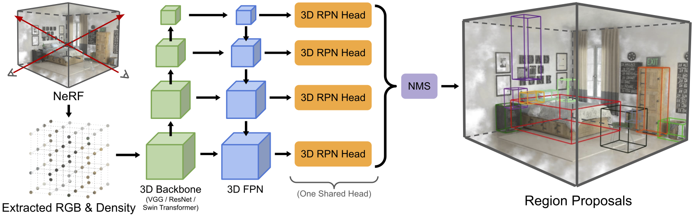

# NeRF-RPN
[](https://arxiv.org/abs/2211.11646) [](https://youtu.be/M8_4Ih1CJjE) [](https://hkustconnect-my.sharepoint.com/:f:/g/personal/bhuai_connect_ust_hk/Ekjf3YC0W9BMsc-jHWXI4xEBy5s_OJBLEbebNVIprd4zMg?e=FgbN9S) [](#citation)

NeRF-RPN: A general framework for object detection in NeRFs [NeRF-RPN, CVPR 2023].

This is the official pytorch implementation of [NeRF-RPN](https://arxiv.org/abs/2211.11646).

> [**NeRF-RPN: A general framework for object detection in NeRFs**](https://arxiv.org/abs/2211.11646)           
> Benran Hu*, Junkai Huang*, Yichen Liu*, Yu-Wing Tai, Chi-Keung Tang           
> IEEE/CVF Conference on Computer Vision and Pattern Recognition (CVPR), 2023 


## Highlights
- **NeRF-RPN**: The first general framework for object detection in NeRFs, which introduces RPN to NeRF for 3D object detection and related tasks. 
- **NeRF Dataset**: The first large-scale public indoor NeRF dataset for 3D object detection, based on the existing synthetic indoor dataset [Hypersim](https://github.com/apple/ml-hypersim) and [3D-FRONT](https://tianchi.aliyun.com/specials/promotion/alibaba-3d-scene-dataset) & [3D-FUTURE](https://tianchi.aliyun.com/specials/promotion/alibaba-3d-future), and real-world indoor dataset [ScanNet](http://www.scan-net.org/), carefully curated for NeRF training.


## NeRF-RPN Model Architecture


## Setup
### Requirements
- Ubuntu 18.04 
- CUDA Version 11.1
### Installation
1. Create the virtual environment:
    ```bash
    conda env create -f environment.yml
    conda activate nerfrpn
    ```
2. Compile CUDA extension:
    ```bash
    cd ./nerf_rpn/model/rotated_iou/cuda_op
    python setup.py install
    cd ../../../..
    ```
    This extension is used to calculate the intersection over union(IoU) of oriented 3D bounding boxes. Refer to [Rotated_IoU](https://github.com/lilanxiao/Rotated_IoU) for more information.

## Dataset Download
Follow the [instructions](./data/README.md) to download and get more information about the dataset. 


## Use Pretrained Model Weights
We release pertrained model weights on Hypersim, 3D-FRONT, and ScanNet NeRF datasets, using VGG19, ResNet50, and Swin-S as backbones. The models can be downloaded [here](https://hkustconnect-my.sharepoint.com/:f:/g/personal/bhuai_connect_ust_hk/EpNYHQqMmMBLrpOeQy9J5ZEBHLi7FsKSGwS1GG82sZqo2w?e=eVo4rc).

The model names are organized in the form of `{dataset name}_{method}_{backbone name}`, where "anchor" refers anchor-based head and "fcos" refers to anchor-free head. 

All the models are trained to predict OBB for proposals, thus enabling `--rotated_bbox` flag is necessary in the testing script. **When using the pretrained models, please enable the `--normalize_density` command line flag only for models trained on 3D-FRONT.**


## Training from Scratch

We provide sample training shell scripts for anchor-based and anchor-free methods separately. Modify the `DATA_ROOT` and dataset split filename according in the scripts first.

```bash
cd ./nerf_rpn
bash train.sh           # train anchor-based model
# bash train_fcos.sh    # or train anchor-free model instead
```

## Evaluation

Evalution scripts are also given under `./nerf_rpn`. Please modify the paths as needed.
```bash
cd ./nerf_rpn
bash test.sh            # test anchor-based model
# bash test_fcos.sh     # or test anchor-free model instead
```

## Inference on Other NeRF Datasets
For pure inference on the three datasets used in the paper, remove the `--boxes_path` line in the test script. 

For custom datasets, you may create a csv file in the following form
```
,scene,rgbsigma_path,boxes_path
,custom_scene_0,/path/to/scene_0.npz,None
,custom_scene_1,/path/to/scene_1.npz,None
,custom_scene_2,/path/to/scene_2.npz,None
...
```

The first column contains user-defined names of the scenes. The second column are the path to corresponding extracted NeRF features. The last column can be left empty if no ground-truth is available.

Then, in the test script, set `--dataset_name` to `general`, and `--test_csv` to be the path to the csv file above. Also set the `--output_proposals` flag, so that the code will save the post-processed proposals with their confidence scores as a `.npz` file under the specified save path.


## Additional Loss

In our test, we found that 2D projection loss and objectness loss do not help to improve our results. However, the training codes are provided for everyone to check and use.  

To test 2D projection loss, you can increase the regression weight through the flag `--loss_rpn_box_reg_2d`

To test objectness loss, i.e., the additional RCNN object/background binary classification stage, first you need to obtain RoIs from a pretrained RPN model. We provide a sample training bash.

```bash
bash train_rcnn.sh
```


## Citation
If you find NeRF-RPN useful in your research or refer to the provided baseline results, please star :star: this repository and consider citing :pencil::
```
@inproceedings{nerfrpn,
    title = {NeRF-RPN: A general framework for object detection in NeRFs},
    author = {Hu, Benran and Huang, Junkai and Liu, Yichen and Tai, Yu-Wing and Tang, Chi-Keung},
    booktitle = {IEEE/CVF Conference on Computer Vision and Pattern Recognition (CVPR)},
    year = {2023}
}
```

